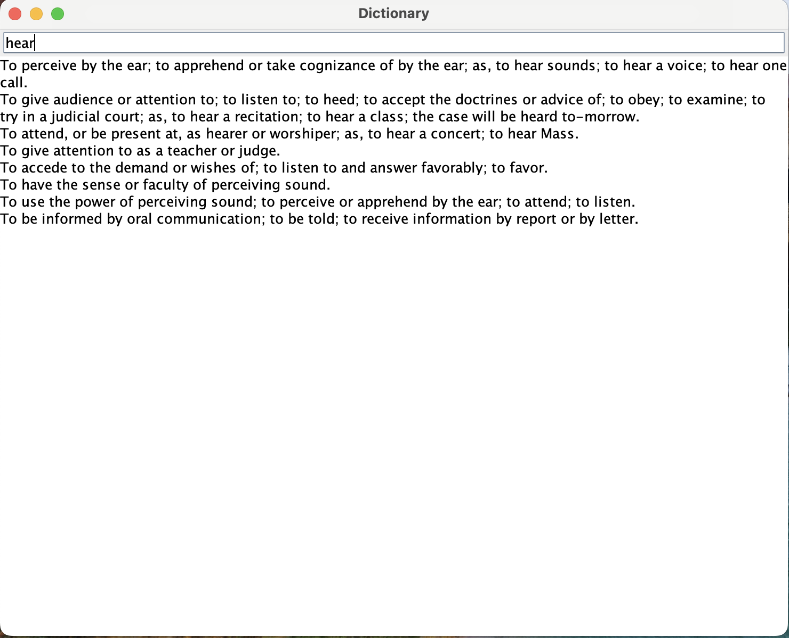

# Dictionary Project

Dictionary is a GUI project in which a user types in a word and a list of definitions for that word is returned.

### Links
[CSV File of Words](https://github.com/andrewoid/evolution-java/blob/main/englishDictionary.csv)

### Technology
[Open CSV](https://opencsv.sourceforge.net/)